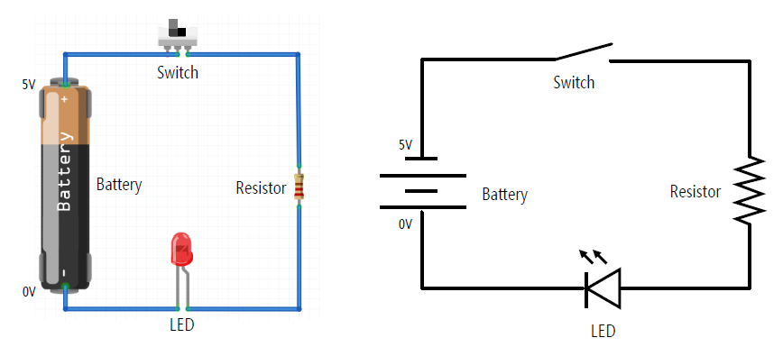
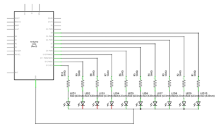
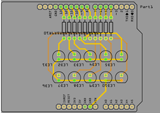

# Actividad de laboratorio 4

> ## Objetivos
> * Comprender los conceptos básicos para realizar prototipado.
> * Explorar algunos de los sensores disponibles en el laboratorio

## Introducción

El uso de sensores y actuadores permiten que las cosas interactuen con el mundo real. En esta sesión vamos a explorar los principales conceptos relacionados con los sensores y actuadores analizando una serie de ejemplos que demuestren su uso basico.

## Actividad previa

1. Colocar aca la actividad a realizar.
2. Mostrar como se instalan las librerias usando fritzing.

## Proceso básico de diseño electronico

Recordemos que inicialmente la comprensión de la capa de percepción la realizamos buscando entender como trabajar con circuitos para lo cual, tal y como se muestra en la siguiente figura, hablamos de **montaje** y **esquematico**.

Cuando se diseña un sistema electronico; desde un punto de vista básico, se realizan los siguientes pasos:
1. Diseñar el circuito: Este procedimiento implica el diseño del **esquematico** ([How to Read a Schematic](https://learn.sparkfun.com/tutorials/how-to-read-a-schematic/all)) en el cual se especifique claramente la conexión de los componentes. La siguiente figura muestra algunos simbolos de uso común:

1. Realizar el montaje del circuito en una protoboard: A partir del esquematico, se procede al montaje y prueba del circuito diseñado conectando los diferentes componentes por medio de una protoboard ([Breadboards for Beginners](https://learn.adafruit.com/breadboards-for-beginners)).

3. Hacer el prototipo: Una vez que el diseño es probado y se determina que funciona de acuerdo a las especificaciones, se procede a diseñar el circuito impreso del diseño. Para ello se pueden usar programas de diseño PCB como KiCad o Eagle.

## Componentes electronicos

La interacción de un sistema embebido con el mundo exterior se hace a traves de sensores y actuadores (ver: [Interact with the physical world with sensors and actuators](https://microsoft.github.io/IoT-For-Beginners/#/1-getting-started/lessons/3-sensors-and-actuators/README)), la siguiente (Tomada del repo IoT For Beginners) figura resume algunos sensores y actuadores:

La siguiente tabla muestra mayot información sobre algunos de los principales elementos de entrada y salida:

|Elemento|Tutorial|
|--|--|
|Resistencias|[Resistors](https://learn.sparkfun.com/tutorials/resistors)|
|Leds|[Light-Emitting Diodes (LEDs)](https://learn.sparkfun.com/tutorials/light-emitting-diodes-leds?_ga=2.225295578.159243291.1638157468-812475524.1634861735)|
|Potenciometros|[Voltage Dividers](https://learn.sparkfun.com/tutorials/voltage-dividers)|
|Capacitores|[Capacitors](https://learn.sparkfun.com/tutorials/capacitors)|
|Diodos|[Diodes](https://learn.sparkfun.com/tutorials/diodes)|
|Transistores|[Transistors](https://learn.sparkfun.com/tutorials/transistors)|
|Motores|[Motors and Selecting the Right One](https://learn.sparkfun.com/tutorials/motors-and-selecting-the-right-one)|
|Display LCD|[Basic Character LCD Hookup Guide](https://learn.sparkfun.com/tutorials/basic-character-lcd-hookup-guide?_ga=2.57652842.159243291.1638157468-812475524.1634861735)|
|Acelerometro|[Accelerometer Basics](https://learn.sparkfun.com/tutorials/accelerometer-basics)|
|Led Infrarrojo|[IR Communication](https://learn.sparkfun.com/tutorials/ir-communication)|
|Sensor de humedad|[Soil Moisture Sensor Hookup Guide](https://learn.sparkfun.com/tutorials/soil-moisture-sensor-hookup-guide?_ga=2.70021712.159243291.1638157468-812475524.1634861735)|
|Giroscopo|[Gyroscope](https://learn.sparkfun.com/tutorials/gyroscope)|
|Joystick|[Thumb Joystick Hookup Guide](https://learn.sparkfun.com/tutorials/thumb-joystick-hookup-guide?_ga=2.67418961.159243291.1638157468-812475524.1634861735)|
|Cables|[Working with Wire](https://learn.sparkfun.com/tutorials/working-with-wire?_ga=2.225295578.159243291.1638157468-812475524.1634861735)|
|Fotocelda|[Photocell Hookup Guide](https://learn.sparkfun.com/tutorials/photocell-hookup-guide?_ga=2.225295578.159243291.1638157468-812475524.1634861735)|
|Servomotores|[Hobby Servo Tutorial](https://learn.sparkfun.com/tutorials/hobby-servo-tutorial?_ga=2.57505002.159243291.1638157468-812475524.1634861735)|
|Baterias|[Battery Technologies](https://learn.sparkfun.com/tutorials/battery-technologies)|
|Sensor de temperatura|[DHT11, DHT22 and AM2302 Sensors](https://learn.adafruit.com/dht)|
|Sensor de ultrasonido|[Ultrasonic Sonar Distance Sensors](https://learn.adafruit.com/ultrasonic-sonar-distance-sensors)|
|Sensor de proximidad|[PIR Motion Sensor](https://learn.adafruit.com/pir-passive-infrared-proximity-motion-sensor)|

## Referncias

1. https://github.com/jonfroehlich/CSE590Sp2018
2. https://microsoft.github.io/IoT-For-Beginners/#/
3. https://learn.adafruit.com/series/learn-arduino
4. https://learn.sparkfun.com/tutorials/experiment-guide-for-the-johnny-five-inventors-kit?_ga=2.204321872.159243291.1638157468-812475524.1634861735
5. https://learn.adafruit.com/adabox001/introduction

