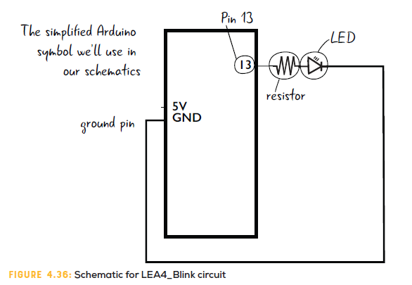
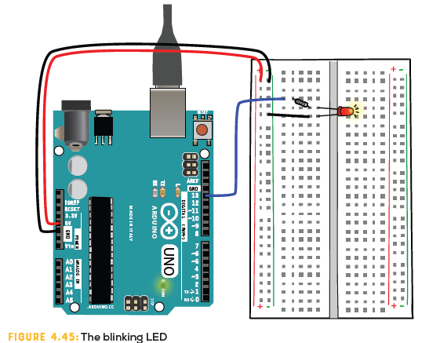

# Ejemplo 1

## Descripción

Hacer una breve descripción del circuito.

## Componentes

Hacer una tabla con los componentes

## Esquematico



## Montaje



## Codigo

Este código fue tomado de: [LEA4_SOS.ino](https://github.com/arduinotogo/LEA/blob/master/LEA4_SOS.ino)

```arduino
void setup() {
  // put your setup code here, to run once:
  pinMode(13, OUTPUT);
}

void loop() {
  // 3 short flashes
  digitalWrite(13, HIGH);//turn the LED on(HIGH is the voltage level)
  delay(500);            //wait for a half second
  digitalWrite(13, LOW); //turn the LED off by making the voltage LOW
  delay(300);      //pause for 300 milliseconds, about 1/3 of a second
  digitalWrite(13, HIGH);   
  delay(500);              
  digitalWrite(13, LOW);    
  delay(300); 
  digitalWrite(13, HIGH);   
  delay(500);              
  digitalWrite(13, LOW);    
  delay(300);   
  
   //three long flashes
  digitalWrite(13, HIGH);   //turn the LED on 
  delay(1500);              //wait for a second and a half
  digitalWrite(13, LOW); //turn the LED off by making the voltage LOW
  delay(300); 
  digitalWrite(13, HIGH);   
  delay(1500);             
  digitalWrite(13, LOW);   
  delay(300); 
  digitalWrite(13, HIGH);   
  delay(1500);             
  digitalWrite(13, LOW);    
  delay(300);   
    
   // 3 short flashes again
  digitalWrite(13, HIGH); //turn the LED on 
  delay(500);            //wait for a half second
  digitalWrite(13, LOW); //turn the LED off by making the voltage LOW
  delay(300); 
  digitalWrite(13, HIGH);   
  delay(500);              
  digitalWrite(13, LOW);    
  delay(300); 
  digitalWrite(13, HIGH);   
  delay(500);              
  digitalWrite(13, LOW);    
  delay(3000);         //final delay is 3 seconds
}
```

## Archivos de test

1. **Archivo Fritzing**
2. **Enlace tinkercad**
3. **Codigo fuente**

