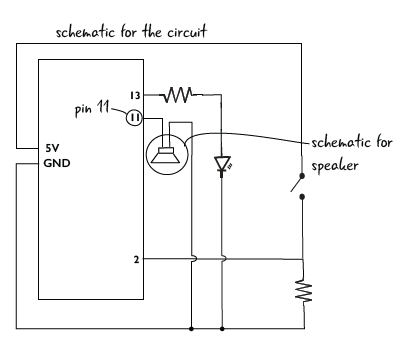
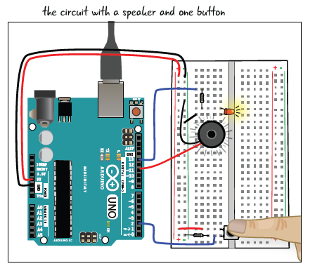

# Ejemplo 2

## Descripción

En este circuito se muestra como se apaga un led y se enciende un speaker que genera ruido cuando se presiona un boton, cuando el mismo se deja de presionar el led se ilumina nuevamente y el speaker deja de generar sonido

## Componentes

|Nombre|Cantidad|Componente|
|---|---|---|
|U1	|1	| Arduino Uno R3 |
|R1	|1	| Resistencia 1kΩ |
|S1	|1	| Pulsador |
|PIEZO1	|1	| Resistencia de 220 Ω |
|R2	|1	| Resistencia de 220 Ω |
|D1	|1	| LED rojo |

## Esquematico

## Montaje

## Codigo
/*
  Button
 Turns on and off a light emitting diode(LED) connected to digital
 pin 13, when pressing a pushbutton attached to pin 2.
 The circuit:
 * LED attached from pin 13 to ground
 * pushbutton attached to pin 2 from +5V
 * 10K resistor attached to pin 2 from ground
 * Note: on most Arduinos there is already an LED on the board
 attached to pin 13.
 created 2005
 by DojoDave <http://www.0j0.org>
 modified 30 Aug 2011
 by Tom Igoe
modified 1 Aug 2017
by Jody Culkin and Eric Hagan
*/

// constants won't change. They're used here to
// set pin numbers:
const int buttonPin = 2;     // the number of the pushbutton pin
const int ledPin = 13;       //the number of the LED pin
const int speakerPin = 11;    //the number of the speaker pin

// variables will change:
int buttonState = 0;         // variable for reading the pushbutton status

void setup() {
  // initialize the pushbutton pins as inputa:
  pinMode(buttonPin, INPUT);
  // initialize the LED pin and the Speaker pin as an output:
  pinMode(speakerPin, OUTPUT);
  pinMode(ledPin, OUTPUT);
}

void loop() {
  // read the state of the pushbutton value:
  buttonState = digitalRead(buttonPin);

  // check if the pushbutton is pressed.
  if (buttonState == HIGH) {
    digitalWrite(ledPin, HIGH);
    tone (speakerPin, 330);
  }
  else {
    // turn LED off:
    noTone(speakerPin);
    digitalWrite(ledPin, LOW);
  }
}
Este código fue tomado de: [LEA6_1_toneButton.ino](https://github.com/arduinotogo/LEA/blob/master/LEA6_1_toneButton.ino)

## Archivos de test

1. **Archivo Fritzing**: //[ejemplo1.fzz](ejemplo1.fzz)
2. **Codigo fuente**: //[ejemplo1.ino](ejemplo1.ino)
2. **Enlace tinkercad**: //[link simulación](https://www.tinkercad.com/things/9BWo9dmFfJF) 
